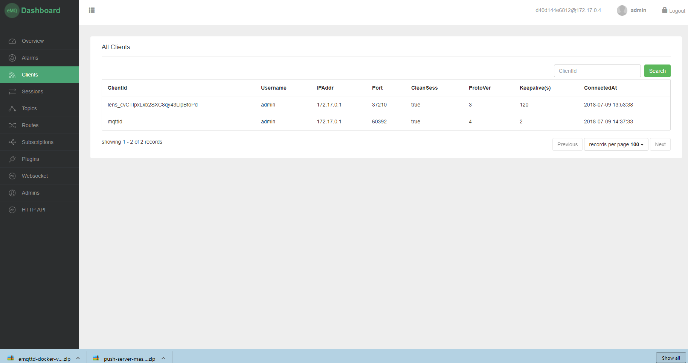
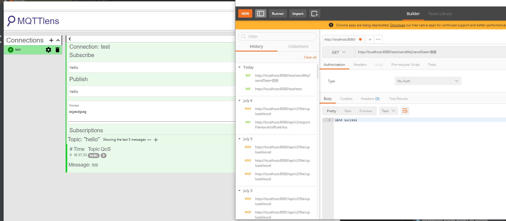

# Emqtt-Springbot
使用Emqtt进行mqtt协议的传输发布消息。通过订阅对应的topic进行推送内容。

# 第三方

* [Emqtt](http://www.emqtt.com/)
* maven依赖
```
        <dependency>
            <groupId>org.springframework.boot</groupId>
            <artifactId>spring-boot-starter-integration</artifactId>
        </dependency>
        <dependency>
            <groupId>org.springframework.integration</groupId>
            <artifactId>spring-integration-stream</artifactId>
        </dependency>
         <dependency>
            <groupId>org.springframework.integration</groupId>
            <artifactId>spring-integration-mqtt</artifactId>
         </dependency>
```
* lombok
 
# 配置和代码介绍

* 进行配置相关的Mqtt的配置项
```$xslt
spring:
  mqtt:
    username: admin 
    password: public
    host-url: tcp://localhost:1883
    client-id: mqttId
    default-topic: topic
```

**MqttProperties.java**进行配置对应的属性内容
```java
@Getter
@Setter
@ConfigurationProperties("spring.mqtt")
@Component
public class MqttProperties {

    private String username;

    private String password;

    private String hostUrl;

    private String clientId;

    private String defaultTopic;

}

```

* 进行配置Mqtt的配置内容
```java
@Configuration
public class MqttConfiguration {

    @Autowired
    private MqttProperties mqttProperties;

    @Bean
    public MqttConnectOptions getMqttConnectOptions(){
        MqttConnectOptions mqttConnectOptions=new MqttConnectOptions();
        mqttConnectOptions.setUserName(mqttProperties.getUsername());
        mqttConnectOptions.setPassword(mqttProperties.getPassword().toCharArray());
        mqttConnectOptions.setServerURIs(new String[]{mqttProperties.getHostUrl()});
        mqttConnectOptions.setKeepAliveInterval(2);
        return mqttConnectOptions;
    }
    @Bean
    public MqttPahoClientFactory mqttClientFactory() {
        DefaultMqttPahoClientFactory factory = new DefaultMqttPahoClientFactory();
        factory.setConnectionOptions(getMqttConnectOptions());
        return factory;
    }
    @Bean
    @ServiceActivator(inputChannel = "mqttOutboundChannel")
    public MessageHandler mqttOutbound() {
        MqttPahoMessageHandler messageHandler =  new MqttPahoMessageHandler(mqttProperties.getClientId(), mqttClientFactory());
        messageHandler.setAsync(true);
        messageHandler.setDefaultTopic(mqttProperties.getDefaultTopic());
        return messageHandler;
    }
    @Bean
    public MessageChannel mqttOutboundChannel() {
        return new DirectChannel();
    }

}

```

* 对应的推送

这里可以根据你想要发送给订阅者对应的内容，随意替换类型。
```java
@MessagingGateway(defaultRequestChannel = "mqttOutboundChannel")
public interface MqttTestServer {
    void sendToMqtt(String data, @Header(MqttHeaders.TOPIC)String topic);
}


```
* 进行通过Controller进行发送
```java
@RestController
@RequestMapping("/test")
public class TestController {

    @Autowired
    private MqttTestServer mqttTestServer;

    @GetMapping("/sendMq")
    public  String sendMqtt(String sendData){
        mqttTestServer.sendToMqtt(sendData, "hello");
        return "send success";
    }


}


```

* 当我们项目运行起来后如图所示(图1.1)


<center>图1.1</center>


* 进行模拟订阅和发送。这里使用了Chrom 的`MQTTlens` 进行测试mqtt协议的传输。



可以看到 正常的收到了，订阅的信息。
